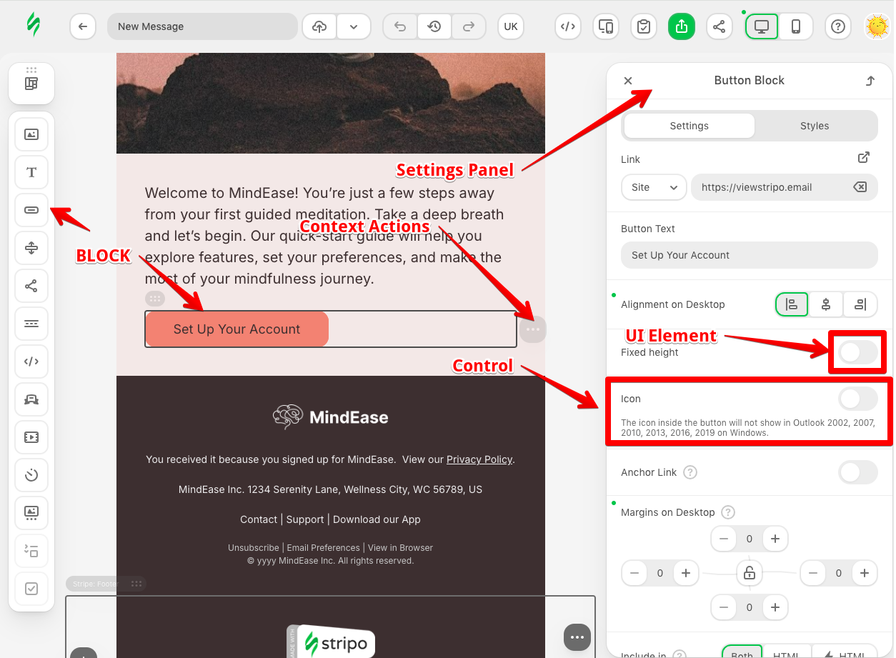

# Stripo Editor Extensions Documentation

# Table of Contents

- [Introduction](#introduction)
    - [About Stripo Editor Extensions](#about-stripo-editor-extensions)
    - [Key Benefits](#key-benefits)
- [Core Concepts](#core-concepts)
    - [Extension Architecture](#extension-architecture)
    - [Implementation Details](#implementation-details)
    - [Template Modification Constraints](#template-modification-constraints)
- [Getting Started](#getting-started)
    - [Prerequisites](#prerequisites)
    - [Setting Up Your Extension Project](#setting-up-your-extension-project)
    - [Creating Your First Extension](#creating-your-first-extension)
- [Extension Components](#extension-components)
    - [ExtensionBuilder](#extensionbuilder)
    - [Block](#block)
    - [UI Element](#ui-element)
    - [Control](#control)
    - [Built-in Control](#built-in-control)
    - [Settings Panel](#settings-panel)
    - [Context Action](#context-action)
    - [Tag Registry](#tag-registry)
- [Template Modification System](#template-modification-system)
    - [ImmutableNode Classes](#immutablenode-classes)
    - [TemplateModifier Class](#templatemodifier-class)
    - [Chaining Modifications](#chaining-modifications)
- [Advanced Topics](#advanced-topics)
    - [Internationalization](#internationalization)
    - [Custom Styling](#custom-styling)
    - [Custom Renderers](#custom-renderers)
    - [Editor configuration](#editor-configuration)
    - [Simplified Structure Templates with BlockType Aliases](#simplified-structure-templates-with-blocktype-aliases)
    - [External Images Library](#external-images-library)
    - [External Smart Elements Library](#external-smart-elements-library)
    - [External AI Assistant](#external-ai-assistant)
    - [Custom Font Management](#custom-font-management)
    - [Editor State Management](#editor-state-management)
    - [Click Outside Behavior](#click-outside-behavior)
- [Examples and Tutorials](#examples-and-tutorials)

## Introduction

### About Stripo Editor Extensions

The Stripo Editor Extensions system allows developers to extend the functionality of Stripo editor with custom components, controls, and behaviors. This modular approach enables you to create tailored editing experiences while maintaining compatibility with the core editor.

### Key Benefits

- **Modularity**: Add only the components you need
- **Customization**: Create custom UI elements, blocks, and controls
- **Integration**: Seamlessly integrate with the existing editor functionality
- **Internationalization**: Built-in support for multiple languages
- **Styling**: Add custom styles for your extensions

## Core Concepts

### Extension Architecture

Extensions are specially structured JavaScript objects that enhance the Stripo editor's functionality. During initialization, the editor accepts an array of these extensions, which are created by extending existing abstract classes and implementing custom logic.

Each extension can include various optional components:
- Styles
- Translations
- Custom blocks
- UI controls
- Other extension-specific functionality

You only need to define the components required for your specific extension.

### Implementation Details

Extensions can be written in either JavaScript or TypeScript, as the editor requires compiled JavaScript code for execution. The implementation language choice is flexible as long as the final output is JavaScript.

### Template Modification Constraints

The Stripo Editor Extensions system enforces strict rules regarding HTML and CSS template modifications:

- Direct modification of HTML or CSS templates is not permitted
- All HTML and CSS elements are exposed as immutable nodes with getter methods only
- This design is necessary to support collaborative editing features, ensuring changes are properly tracked and synchronized between users
- To modify templates within the extension system, use the `TemplateModifier` API, which provides controlled methods for template manipulation while maintaining synchronization across users in collaborative environments.

## Getting Started

### Prerequisites

- Node.js (v14.x or higher)
- npm or yarn
- Understanding of TypeScript/JavaScript
- Familiarity with UI development concepts

### Setting Up Your Extension Project

Add the dependency:
```
npm i @stripoinc/ui-editor-extensions
```

### Creating Your First Extension

```javascript
// Import the ExtensionBuilder from the package
import { ExtensionBuilder } from '@stripoinc/ui-editor-extensions';

// Create a new extension using the builder pattern
const extension = new ExtensionBuilder()
    // Add custom CSS styles to change the color of blocks panel
    .withStyles('ue-ui-simple-panel {background-color: darkgray;}')
    .build();

// Initialize the Stripo editor with your extension
window.UIEditor.initEditor(
    document.querySelector('#stripoEditorContainer'), // Target container for the editor
    {
        // Your editor configuration options go here
        ...,
        // Register your extensions
        extensions: [
            extension
        ]
    }
);
```

The complete example of extension you can find [here](https://github.com/stripoinc/stripo-plugin-samples/tree/extensions/extensions/01-hello-world).

## Extension Components

The extension system is built around a core set of interfaces and abstract classes that developers can implement to extend functionality.

The main components you can include in an extension are:
1. **Blocks**: Custom content blocks that can be added to the editor
2. **UI Elements**: Custom UI elements to extend the editor interface
3. **Controls**: Form controls for settings panels
4. **Settings Panels**: Panels for configuring blocks
5. **Context Actions**: Actions that appear in block's context menus
6. **Tag Registry**: Helps to override default UiElements with custom HTML tags



### ExtensionBuilder

The `ExtensionBuilder` class provides a fluent interface for creating editor extensions.

#### Methods

| Method | Description | Parameters | Return Type |
|--------|-------------|------------|-------------|
| `constructor()` | Creates a new ExtensionBuilder instance. | None | `ExtensionBuilder` |
| `withLocalization(localizationMap)` | Adds localization data to the extension. | `localizationMap`: Object mapping language codes to objects containing key-value pairs for translations. | `ExtensionBuilder` |
| `withStyles(stylesString)` | Adds custom CSS styles to the extension. | `stylesString`: String containing CSS rules. | `ExtensionBuilder` |
| `withPreviewStyles(stylesString)` | Adds custom CSS styles for the editor document preview. | `stylesString`: String containing CSS rules. | `ExtensionBuilder` |
| `addBlock(blockClass)` | Registers a custom block with the extension. | `blockClass`: Custom Block class implementation. | `ExtensionBuilder` |
| `addUiElement(uiElementClass)` | Registers a custom UI element with the extension. | `uiElementClass`: Custom UiElement class implementation. | `ExtensionBuilder` |
| `addContextAction(contextActionClass)` | Registers a custom context action with the extension. | `contextActionClass`: Custom ContextAction class implementation. | `ExtensionBuilder` |
| `addControl(controlClass)` | Registers a custom control with the extension. | `controlClass`: Custom Control class implementation. | `ExtensionBuilder` |
| `withSettingsPanelRegistry(settingsPanelRegistryClass)` | Registers a custom settings panel registry with the extension. | `settingsPanelRegistryClass`: Custom SettingsPanelRegistry class implementation. | `ExtensionBuilder` |
| `withUiElementTagRegistry(uiElementTagRegistryClass)` | Registers a custom tag registry with the extension. | `uiElementTagRegistryClass`: Custom UIElementTagRegistry class implementation. | `ExtensionBuilder` |
| `withExternalSmartElementsLibrary(externalSmartElementsLibraryClass)` | Registers an external smart elements library. | `externalSmartElementsLibraryClass`: Custom ExternalSmartElementsLibrary class implementation. | `ExtensionBuilder` |
| `withExternalImageLibrary(externalImageLibraryClass)` | Registers an external image library. | `externalImageLibraryClass`: Custom ExternalImageLibrary class implementation. | `ExtensionBuilder` |
| `withExternalAiAssistant(externalAiAssistantClass)` | Registers an external AI assistant. | `externalAiAssistantClass`: Custom ExternalAiAssistant class implementation. | `ExtensionBuilder` |
| `withExternalImageLibrary(externalImageLibraryClass)` | Registers an external image library. | `externalImageLibraryClass`: Custom ExternalImageLibrary class implementation. | `ExtensionBuilder` |
| `build()` | Finalizes and returns the extension instance. | None | `Extension` |

### Block

#### Overview

Block is the custom content block that can be dragged&dropped to the editor.

#### Creating a Custom Block

To create a custom block, extend the `Block` abstract class:

```javascript
import { Block } from '@stripoinc/ui-editor-extensions';

export class MyCustomBlock extends Block {
    getId() {
        return 'my-custom-block';
    }

    getTemplate() {
        return `
            <td align="left">
                <h2>${this.api.translate('My Custom Block')}</h2>
            </td>
        `;
    }
}
```

#### Block Class and Methods

The `Block` abstract class provides the foundation for creating custom content blocks. Here's an overview of its methods:

| Method                      | Description                                                                       | Required | Default Value        |
|-----------------------------|-----------------------------------------------------------------------------------|----------|----------------------|
| `getId()`                   | Returns a unique identifier for the block. This must be unique within the editor. | Yes      |                      |
| `getIcon()`                 | Returns the icon representation for the block in the blocks panel.                | Yes      |                      |
| `getName()`                 | Returns the display name of the block shown in the blocks panel.                  | Yes      |                      |
| `getDescription()`          | Returns the descriptive text for the block shown in the blocks panel.             | Yes      |                      |
| `getTemplate()`             | Returns an HTML string template that defines the structure of your block.         | Yes      |                      |
| `getContextActionsIds()`    | Returns an array of context action IDs that apply to this block.                  | No       |                      |
| `getCustomRenderer()`       | Returns a custom renderer class for the block, if needed.                         | No       |                      |
| `getUniqueBlockClassname()` | Returns a unique CSS class name for the block.                                    | No       | `esd-${this.getId()}` |
| `isEnabled()`               | Returns whether the block is enabled in the current editor context.               | No       | `true`               |
| `canBeSavedAsModule()`      | Returns whether the block can be saved as a reusable module.                      | No       | `false`              |
| `getBlockCompositionType()` | Determines if block is atomic (Block) or composite (Structure).                   | No       | `BlockCompositionType.BLOCK` |
| `shouldDisplayQuickAddIcon()`| Determines if block should be included in empty container quick insert actions list. | No       | `false`              |
| `allowInnerBlocksSelection()`| Determines if nested blocks selection is allowed in a Structure block.             | No       | `true`               |
| `allowInnerBlocksDND()`     | Determines if nested blocks drag and drop is allowed in a Structure block.          | No       | `true`               |

The `Block` class also provides several lifecycle hooks:

| Lifecycle Hook                  | Description                                                                                                                                                                                                        |
|---------------------------------|--------------------------------------------------------------------------------------------------------------------------------------------------------------------------------------------------------------------|
| `onDocumentInit()`              | Called when the document is initialized. Returns a HtmlNodeModifier if the block needs to modify its HTML structure. This is useful for performing initial setup or validation of block instances in the document. |
| `onSelect(node)`                | Called when the block is selected. Returns a HtmlNodeModifier if the block needs to modify its HTML structure.                                                                                                     |
| `onDrop(node)`                  | Called when the block is dropped into the editor. Returns a HtmlNodeModifier if the block needs to modify its HTML structure.                                                                                      |
| `onCopy(targetNode,sourceNode)` | Called when the block is copied. Returns a HtmlNodeModifier if the block needs to modify its HTML structure.                                                                                                       |
| `onDelete(node)`                | Called when the block is deleted. Returns a HtmlNodeModifier if the block needs to modify its HTML structure.                                                                                                      |
| `onCreated(node)`               | Called after a new instance of this block is created and added to the document.                                                                                                                                    |
| `onDocumentChanged()`           | Called when any part of the document template has changed (can be frequent).                                                                                                                                       |

The `Block` class provides access to the editor API through the `api` property, which offers these useful methods:

| API Method                | Description                                                 |
|---------------------------|-------------------------------------------------------------|
| `getDocumentModifier()`   | Returns a modifier that can be used to modify the document. |
| `getEditorConfig()`       | Returns the current editor configuration.                   |
| `translate(key, params)`  | Translates a text key using the current language settings.  |
| `setViewOnly(isViewOnly)` | Sets whether the block should be view-only.                 |
| `getDocumentRoot()`       | Returns the root element of the document.                   |


### UI Element

#### Overview

UI Element is a fundamental building block of a user interface. It represents a reusable component that enhances consistency and maintainability.
Extract repeating HTML code into standalone UI elements whenever possible. For example, custom-designed input fields or buttons can be converted into reusable components.
Think of UI elements as bricks that will later come together to form a complete interface.

To create a custom UI Element, extend the `UIElement` abstract class and implement the required `getId()`, `getTemplate()`, and `onRender()` methods. You may also override optional methods like `onDestroy()`, `getValue()`, `setValue()`, and `onAttributeUpdated()` based on your component's needs.

#### Available Built-in UI Elements

The Stripo Editor supports the following Built-in UI elements, as defined in the `UIElementType` enum:

| Element | Tag Name | Description |
|---------|----------|-------------|
| Button | `UE-BUTTON` | Allows users to perform a single action |
| Checkbox | `UE-CHECKBOX` | Allows users to switch between boolean states |
| Check Buttons | `UE-CHECK-BUTTONS` | Allows users to select multiple options from a list |
| Color Picker | `UE-COLOR` | Allows users to select colors from default and custom palettes |
| Counter | `UE-COUNTER` | Allows users to input numeric values with increment/decrement controls |
| Date Picker | `UE-DATEPICKER` | Allows users to select dates from a calendar |
| Label | `UE-LABEL` | Displays text labels for form elements |
| Message | `UE-MESSAGE` | Displays informational messages with different styles |
| Radio Buttons | `UE-RADIO-BUTTONS` | Allows users to select one option from a list |
| Select | `UE-SELECT` | Dropdown that allows users to select one or multiple options |
| Switcher | `UE-SWITCHER` | Toggle switch for boolean states |
| Text | `UE-TEXT` | Single-line text input |
| Textarea | `UE-TEXTAREA` | Multi-line text input |

Additionally, there are supporting elements:
- `UE-CHECK-ITEM`: Individual item within Check Buttons
- `UE-RADIO-ITEM`: Individual item within Radio Buttons
- `UE-SELECT-ITEM`: Individual item within Select dropdown

#### UI Element Attributes

Each UI element supports specific attributes that control its behavior and appearance. These attributes are defined in the `UEAttr` object:

##### Common Attributes
All UI elements support these attributes:
- `name`: Unique identifier for the element
- `disabled`: Controls whether the element is interactive

##### Element-Specific Attributes

###### Button
- `caption`: Text displayed on the button

###### Checkbox
- `caption`: Label text for the checkbox

###### Counter
- `min-value`: Minimum allowed value
- `max-value`: Maximum allowed value
- `step`: Increment/decrement step size

###### Date Picker
- `placeholder`: Placeholder text when no date is selected
- `min-date`: Earliest selectable date

###### Label
- `text`: The text content of the label
- `hint`: Additional information displayed as a tooltip

###### Message
- `type`: Message style (error, success, warn, info)

###### Radio Buttons
- `buttons`: Collection of radio options

###### Select
- `searchable`: Whether the dropdown is searchable
- `multi-select`: Whether multiple items can be selected
- `placeholder`: Placeholder text when no option is selected
- `items`: Collection of select options

###### Text and Textarea
- `placeholder`: Placeholder text when empty

###### Textarea
- `resizable`: Whether the textarea can be resized

#### Creating a Custom UI Element

To create a custom UI element, extend the `UiElement` abstract class:

```javascript
import { UiElement } from '@stripoinc/ui-editor-extensions';

export class CustomDesignedSwitcherUiElement extends UiElement {
    // Required: Provide a unique ID for your UI element
    getId() {
        return 'custom-designed-switcher-ui-element';
    }

    // Required: Define the HTML template for your UI element
    getTemplate() {
        return `
            <div class="custom-switcher-container">
                <input type="checkbox" title="${this.api.translate('Custom Switcher')}" class="custom-switcher">
            </div>`;
    }

    // Called after the element is rendered
    onRender(container) {
        this.inputElement = container.querySelector('input');
        this.inputElement.addEventListener('change', this._onChange.bind(this));
    }

    // Clean up event listeners when the element is destroyed
    onDestroy() {
        this.inputElement.removeEventListener('change', this._onChange.bind(this));
    }

    // Internal event handler for input changes
    _onChange(event) {
        this.api.onValueChanged(event.target.value);
    }

    // Get the current value of the UI element
    getValue() {
        return this.inputElement.value;
    }

    // Set the value of the UI element
    setValue(value) {
        this.inputElement.value = value;
    }
}
```

#### Working with UI Elements in Controls

When implementing custom controls, you can use the built-in UI elements by including them in your template:

```javascript
import { Control, UIElementType, UEAttr } from '@stripoinc/ui-editor-extensions';

export class MyCustomControl extends Control {
    getId() {
        return 'my-custom-control';
    }

    getTemplate() {
        const labelTag = UIElementType.LABEL;
        const labelAttr = UEAttr.LABEL;
        const switcherTag = UIElementType.SWITCHER;
        const switcherAttr = UEAttr.SWITCHER;

        return `
            <div>
                <${labelTag} ${labelAttr.text}="Enable Feature:" ${labelAttr.name}="featureLabel"></${labelTag}>
                <${switcherTag} ${switcherAttr.name}="featureSwitcher"></${switcherTag}>
            </div>
        `;
    }

    onRender() {
        // Set initial values
        this.api.updateValues({
            'featureSwitcher': false
        });

        // Listen for changes
        this.api.onValueChanged('featureSwitcher', (newValue) => {
            // Handle value change
            console.log('Feature switched to:', newValue);
        });
    }
}
```

#### The UI Element DOM Interface

UI elements in the DOM implement the `UIEDomElement` interface, which extends `HTMLElement` and adds:

```typescript
interface UIEDomElement extends HTMLElement {
    value: unknown;
    setUIEAttribute(name: string, value: unknown): void;
}
```

This allows you to:
1. Access the element's current value via the `value` property
2. Set element attributes using the `setUEAttribute` method

```javascript
import {UEAttr, UIElementType, UiElement} from '@stripoinc/ui-editor-extensions';

export class CustomCounterUiElement extends UiElement {
    getId() {
        return 'custom-counter-ui-element';
    }

    getTemplate() {
        return `
            <div>
                <${UIElementType.COUNTER} 
                    ${UEAttr.COUNTER.name}="customCounter"
                    ${UEAttr.COUNTER.minValue}="5">
                </${UIElementType.COUNTER}>
            </div>`;
    }

    onRender(container) {
        this.counter = container.querySelector(`${UIElementType.COUNTER}`);

        // Alternative way to set UIElement's attributes
        // This approach allows you to programmatically set attributes after the element is rendered
        // You can use this method to dynamically update attributes based on user interactions or other conditions
        this.counter.setUIEAttribute(UEAttr.COUNTER.step, 2);
        this.counter.setUIEAttribute(UEAttr.COUNTER.maxValue, 10);
        this.counter.value = 7;
    }

    getValue() {
        return this.counter.value;
    }

    setValue(value) {
        this.counter.value = value;
    }
}
```

#### Best Practices for UI Elements

1. **Use Constants**: Use the `UIElementType` and `UEAttr` constants when referencing elements and attributes
2. **Handle Cleanup**: Properly remove event listeners in the `onDestroy` method
3. **Localize Text**: Use the translation API for all user-facing text
4. **Follow Patterns**: Study the examples implementation for patterns and conventions
5. **State Management**: Use `updateValues()` and `onValueChanged()` for managing element state
6. **Dynamic Visibility**: Use `setVisibility()` to show/hide elements based on conditions

#### UiElement Class and Methods

The `UiElement` abstract class provides the foundation for creating custom UI components. Here's an overview of its methods:

| Method                | Description                                                                                                                                                                              | Required |
|-----------------------|------------------------------------------------------------------------------------------------------------------------------------------------------------------------------------------|----------|
| `getId()`             | Returns a unique identifier for the UI element. This must be unique within the editor. This also will be the tag name of UI element by default.                                          | Yes      |
| `getTemplate()`       | Returns an HTML string template that defines the structure of your UI element.                                                                                                           | Yes      |
| `onRender(container)` | Called after the element is rendered. Use this to set up event listeners and initialize your UI element. The `container` parameter is the DOM element containing your rendered template. | Yes      |
| `onAttributeUpdated(name, value)` | Called when one of the element's supported (`UEAttr`) attributes gets updated. The `name` parameter is the attribute name, and `value` is the new attribute value.                | No       |
| `onDestroy()`         | Called when the element is being destroyed. Use this to clean up event listeners and resources.                                                                                          | No       |
| `getValue()`          | Returns the current value of the UI element. Implement this if your UI element maintains state.                                                                                          | No       |
| `setValue(value)`     | Sets the value of the UI element. The `value` parameter is the data to set.                                                                                                              | No       |

The `UiElement` class also provides access to the editor API through the `api` property, which offers these useful methods:

| API Method               | Description                                                  |
|--------------------------|------------------------------------------------------------|
| `onValueChanged(value)`  | Notifies the editor that the UI element's value has changed. |
| `getEditorConfig()`      | Returns the current editor configuration.                    |
| `translate(key, params)` | Translates a text key using the current language settings.   |

### Control

#### Overview

Controls are components used within Settings Panels to configure block or element properties.

To create a custom Control, extend the `Control` abstract class and implement the required `getId()`, `getTemplate()`, and `onTemplateNodeUpdated()` methods. Optional methods like `onRender()` and `onDestroy()` can be used for setup and cleanup.

#### Creating a Custom Control

To create a custom control, extend the `Control` abstract class:

```javascript
import { ModificationDescription, Control } from '@stripoinc/ui-editor-extensions';

export class EventIdControl extends Control {
    // Required: Provide a unique ID for your control
    getId() {
        return 'event-id-control';
    }

    // Required: Define the HTML template for your control
    getTemplate() {
        return `
            <div>
                <ue-label value="${this.api.translate('Enable Event Id')}:"></ue-label>
                <event-id-switcher name="eventIdSwitcher"></event-id-switcher>
            </div>`;
    }

    // Called after the control is rendered
    onRender() {
        this.api.onValueChanged('eventIdSwitcher', (newValue, oldValue) => {
            if (newValue) {
                const eventId = '1';
                this.api.getDocumentModifier()
                    .modifyHtml(this.firstNodeLink)
                    .setAttribute('event-id', eventId)
                    .apply(new ModificationDescription('Added event id {eventId}')
                        .withParams({eventId: eventId}));
            } else {
                this.api.getDocumentModifier()
                    .modifyHtml(this.firstNodeLink)
                    .removeAttribute('event-id')
                    .apply(new ModificationDescription('Removed event id')
                        .withParams({eventId: oldValue}));
            }
        });
    }

    // Called when the template node is updated
    onTemplateNodeUpdated(node) {
        this.firstNodeLink = node.querySelector('a');
        let eventIdFromTemplate = this.firstNodeLink.getAttribute('event-id');

        this.api.updateValues({
            'eventIdSwitcher': !!eventIdFromTemplate
        });
    }
}
```

#### Control Class and Methods

The `Control` abstract class provides the foundation for creating custom settings controls. Here's an overview of its methods:

| Method                        | Description                                                                                                           | Required |
|-------------------------------|-----------------------------------------------------------------------------------------------------------------------|----------|
| `getId()`                     | Returns a unique identifier for the control. This must be unique within the editor.                                   | Yes      |
| `getTemplate()`               | Returns an HTML string template that defines the structure of your control.                                           | Yes      |
| `onRender()`                  | Called after the control is rendered. Use this to set up event listeners.                                             | No       |
| `onDestroy()`                 | Called when the control is being destroyed. Use this to clean up event listeners and resources.                       | No       |
| `onTemplateNodeUpdated(node)` | Called when the template node is updated. Use this to extract settings values from the node (block, structure, etc.). | Yes      |


The `Control` class provides access to the editor API through the `api` property, which offers these useful methods:

| API Method                                | Description                                                                                                 |
|-------------------------------------------|-------------------------------------------------------------------------------------------------------------|
| `getDocumentModifier()`                   | Returns a modifier that can be used to modify the document.                                                 |
| `getEditorConfig()`                       | Returns the current editor configuration.                                                                   |
| `translate(key, params)`                  | Translates a text key using the current language settings.                                                  |
| `getDocumentRootHtmlNode()`               | Returns the root `ImmutableHtmlNode` of the document.                                                       |
| `getDocumentRootCssNode()`                | Returns the root `ImmutableCssNode` of the document.                                                        |
| `setVisibility(uiElementName, isVisible)` | Sets the visibility of a nested `UiElement` within the control by its name.                                 |
| `setUIEAttribute(uiElementName, attribute, value)` | Sets a specific UIElement's attribute (like those defined in `UEAttr`) on a nested `UiElement`.             |
| `getValues()`                             | Returns the current values of all nested `UiElements` within the control as a map (uiElementName -> value). |
| `updateValues(valuesMap)`                 | Updates the values of nested `UiElements` within the control using a map (uiElementName -> value).          |
| `onValueChanged(uiElementName, callback)` | Registers a callback function to be executed when the value of a specific nested `UiElement` changes.       |

### Built-in Control

The Stripo Editor Extensions system provides a powerful mechanism to extend and customize built-in editor controls. This system allows you to modify the behavior, appearance, and functionality of existing controls without completely replacing them.

#### Overview

The built-in controls extension system works by:
1. Extending the `BuiltInControl` abstract class
2. Specifying which built-in control to extend via `getParentControlId()`
3. Providing custom implementations for specific aspects like target nodes, labels, and additional modifications

#### Base `BuiltInControl` Class

All built-in control extensions must extend the `BuiltInControl` abstract class:

```javascript
import { BuiltInControl, BuiltInControlTypes, ControlTargetNodes, ControlLabels, ModificationDescription } from '@stripoinc/ui-editor-extensions';

export class MyBackgroundColorExtension extends BuiltInControl {
    getId() {
        return 'my-custom-background-control';
    }

    getParentControlId() {
        return BuiltInControlTypes.GENERAL.BACKGROUND_COLOR;
    }

    getTargetNodes(root) {
        // Define which nodes this control should operate on
        const targetElements = root.querySelectorAll('.custom-background-target');
        return {
            targetNodes: Array.from(targetElements)
        };
    }

    getLabels() {
        return {
            title: this.api.translate('Custom Background Color')
        };
    }

    getModificationDescription() {
        return new ModificationDescription('Applied custom background styling');
    }

    getAdditionalModifications(root) {
        // Add custom modifications that should be applied alongside the parent control
        return this.api.getDocumentModifier()
            .modifyHtml(root.querySelector('.additional-target'))
            .setAttribute('data-custom-bg', 'true');
    }
}
```

#### Specialized Built-in Control Classes

The system provides specialized base classes for common control types:

##### `BackgroundColorBuiltInControl`

For extending background color functionality:

```javascript
import { BackgroundColorBuiltInControl } from '@stripoinc/ui-editor-extensions';

export class CustomBackgroundControl extends BackgroundColorBuiltInControl {
    getId() {
        return 'enhanced-background-control';
    }

    getTargetNodes(root) {
        // Target specific elements for background color changes
        const containers = root.querySelectorAll('.custom-container');
        return {
            targetNodes: Array.from(containers)
        };
    }

    getAdditionalModifications(root) {
        // Add gradient support alongside solid colors
        return this.api.getDocumentModifier()
            .modifyHtml(root.querySelector('.gradient-container'))
            .setAttribute('data-supports-gradient', 'true');
    }
}
```

##### `FontFamilyBuiltInControl`

For extending font family functionality:

```javascript
import { FontFamilyBuiltInControl } from '@stripoinc/ui-editor-extensions';

export class CustomFontFamilyControl extends FontFamilyBuiltInControl {
    getId() {
        return 'enhanced-font-family-control';
    }

    getTargetNodes(root) {
        // Target text elements for font family changes
        const textElements = root.querySelectorAll('h1, h2, h3, p, span');
        return {
            targetNodes: Array.from(textElements)
        };
    }

    getLabels() {
        return {
            title: this.api.translate('Enhanced Font Selection')
        };
    }
}
```

##### `TextColorBuiltInControl`

For extending text color functionality:

```javascript
import { TextColorBuiltInControl } from '@stripoinc/ui-editor-extensions';

export class CustomTextColorControl extends TextColorBuiltInControl {
    getId() {
        return 'enhanced-text-color-control';
    }

    getTargetNodes(root) {
        // Target text elements for color changes
        const textElements = root.querySelectorAll('h1, h2, h3, p, span, a');
        return {
            targetNodes: Array.from(textElements)
        };
    }

    getLabels() {
        return {
            title: this.api.translate('Enhanced Text Color')
        };
    }
}
```

#### `ControlTargetNodes` Interface

Defines which DOM nodes the control should operate on:

```typescript
interface ControlTargetNodes {
    targetNodes: ImmutableHtmlNode[];
}
```

#### `ControlLabels` Interface

Allows customization of control UI labels:

```typescript
interface ControlLabels {
    title: string;
}
```

#### Registering Built-in Control Extensions

Register your built-in control extensions using the `addControl` method:

```javascript
const extension = new ExtensionBuilder()
    .addControl(MyBackgroundColorExtension)
    .addControl(CustomFontFamilyControl)
    .build();
```

### Settings Panel

#### Overview

Settings Panels group Controls to provide a configuration interface for specific blocks or editor features.

To define how controls are organized into settings panels for different blocks, create a class that extends `SettingsPanelRegistry` and implement the `registerBlockControls()` method. This method receives a map where you can associate block IDs with arrays of `SettingsPanelTab` configurations.

#### Creating a Settings Panel

To create a settings panel, implement the `SettingsPanelRegistry` abstract class:

```javascript
import {
    GeneralControls,
    SettingsPanelRegistry,
    SettingsPanelTab,
    SettingsTab,
    TextControls, BlockType
} from '@stripoinc/ui-editor-extensions';

export class CustomSettingsPanelRegistry extends SettingsPanelRegistry {
    registerBlockControls(blockControlsMap) {
        blockControlsMap[BlockType.BLOCK_TEXT] = [
            new SettingsPanelTab(
                SettingsTab.SETTINGS,
                [
                    TextControls.PARAGRAPH_STYLE
                ]),
            new SettingsPanelTab(
                'customStyles',
                [
                    GeneralControls.BACKGROUND_COLOR
                ])
                .withLabel('Custom styles'),
        ]

        // Add a control to an existing tab for a built-in block
        blockControlsMap[BlockType.BLOCK_BUTTON].find(tabs => tabs.getTabId() == SettingsTab.SETTINGS).addControl('my-custom-control', 2);

    }
}
```

#### SettingsPanelRegistry Class and Methods

The `SettingsPanelRegistry` abstract class provides the foundation for creating custom settings panels. Here's an overview of its methods:

| Method                                    | Description                                                                                                                                       | Required |
|-------------------------------------------|---------------------------------------------------------------------------------------------------------------------------------------------------|----------|
| `registerBlockControls(blockControlsMap)` | Configures which controls appear in which tabs for specific blocks. The `blockControlsMap` parameter is a mapping of block IDs to arrays of tabs. | Yes      |

The `SettingsPanelRegistry` class provides access to the editor API through the `api` property, which offers these useful methods:

| API Method               | Description                                                |
|--------------------------|------------------------------------------------------------|
| `getEditorConfig()`      | Returns the current editor configuration.                  |
| `translate(key, params)` | Translates a text key using the current language settings. |

#### SettingsPanelTab Class and Methods

The `SettingsPanelTab` class is used to define tabs within settings panels. Here's an overview of its methods:

| Method                            | Description                                                                         |
|-----------------------------------|-------------------------------------------------------------------------------------|
| `constructor(tabId, controlsIds)` | Creates a new tab with the given ID and array of control IDs.                       |
| `getTabId()`                      | Returns the tab's unique identifier.                                                |
| `getLabel()`                      | Returns the tab's display label.                                                    |
| `getControlsIds()`                | Returns the array of control IDs contained in this tab.                             |
| `withLabel(label)`                | Sets the display label for the tab and returns the tab instance for chaining.       |
| `addControl(controlId, position)` | Adds a control at the specified position and returns the tab instance for chaining. |
| `deleteControl(controlId)`        | Removes a control from the tab by its ID.                                           |

#### Understanding the Settings Panel System

Unlike the simplified example in the previous documentation, the actual settings panel system works by providing a mapping between block IDs and arrays of tabs with controls. The key points to understand:

1. You implement `registerBlockControls` to define which controls appear for which blocks
2. The `blockControlsMap` parameter is a record where:
    - Keys are block identifiers (like 'useful-links-block')
    - Values are arrays of `SettingsPanelTab` instances
3. Each tab contains an array of control IDs that should be displayed in that tab
4. You can:
    - Create entirely new panels for blocks
    - Modify existing panels by adding or removing controls
    - Reorganize controls between tabs


### Context Action

Context actions appear in context menus for blocks and provide access to common operations like copy, delete, move.

#### Creating a Custom Context Action

To create a custom context action, extend the `ContextAction` abstract class:

```javascript
import { ContextAction } from '@stripoinc/ui-editor-extensions';

export class CustomContextAction extends ContextAction {
    // Required: Provide a unique ID for your context action
    getId() {
        return 'ai-magic-context-action';
    }

    getIconClass() {
        return 'plus';
    }

    getLabel() {
        return this.api.translate('Magic button');
    }

    onClick(node) {
        console.log(`Magic button clicked for block: ${node.getOuterHTML()}`);
    }
}
```

#### ContextAction Class and Methods

The `ContextAction` abstract class provides the foundation for creating custom context menu actions. Here's an overview of its methods:

| Method           | Description                                                                                                                   | Required |
|------------------|-------------------------------------------------------------------------------------------------------------------------------|----------|
| `getId()`        | Returns a unique identifier for the action. This must be unique within the editor.                                            | Yes      |
| `getIconClass()` | Returns the CSS class name for the action's icon.                                                                             | Yes      |
| `getLabel()`     | Returns the display label for the action.                                                                                     | Yes      |
| `onClick(node)`  | Handles the click event when the action is clicked. The `node` parameter is the DOM element the action is being performed on. | Yes      |

The `ContextAction` class provides access to the editor API through the `api` property, which offers these useful methods:

| API Method               | Description                                                 |
|--------------------------|-------------------------------------------------------------|
| `getDocumentModifier()`  | Returns a modifier that can be used to modify the document. |
| `getEditorConfig()`      | Returns the current editor configuration.                   |
| `translate(key, params)` | Translates a text key using the current language settings.  |

#### Best Practices for Creating Context Actions

When implementing context actions, follow these guidelines:

1. **Clear Purpose**: Each action should have a clear, specific purpose
2. **Meaningful Icon**: Use a meaningful icon that clearly communicates the action's purpose
3. **Proper Naming**: Use descriptive IDs that indicate both the target block and the action
4. **Internationalization**: Use the translation API for all user-facing text
5. **Proper Error Handling**: Handle errors gracefully within your action handler
6. **Consistent Behavior**: Maintain consistency with the editor's existing context actions
7. **Performance**: Keep action execution fast and responsive

### Tag Registry

#### Overview

Tag Registry is a component that allows you to re-map UI elements to custom HTML tags in the editor, enabling you to override or extend build-in UI elements.

#### Creating a Custom Tag Registry

To create a custom tag registry, extend the `UIElementTagRegistry` abstract class:

```javascript
import {UIElementType, UIElementTagRegistry} from '@stripoinc/ui-editor-extensions';

export class CustomTagRegistry extends UIElementTagRegistry {
    registerUiElements(uiElementsTagsMap) {
        // Override the default color picker with a custom one
        uiElementsTagsMap['original-ue-color'] = uiElementsTagsMap[UIElementType.COLOR];
        uiElementsTagsMap[UIElementType.COLOR] = 'custom-color-picker-ui-element';
    }
}
```

#### UIElementTagRegistry Class and Methods

The `UIElementTagRegistry` abstract class provides the foundation for mapping custom HTML tags to UI elements. Here's an overview of its methods:

| Method                                  | Description                                                                                                                                    |
|-----------------------------------------|------------------------------------------------------------------------------------------------------------------------------------------------|
| `registerUiElements(uiElementsTagsMap)` | Configures the mapping between HTML tags and UI elements. The `uiElementsTagsMap` parameter is a mapping between tag names and UI element IDs. |


#### Understanding the Tag Registry System

Key points to understand:

1. The `uiElementsTagsMap` parameter in `registerUiElements` is a record where:
    - Keys are HTML tag names
    - Values are UI element IDs
2. When the editor encounters a tag from this mapping, it will render the corresponding UI element. Use it in `getTemplate` method of `Control`
3. You can override existing mappings to replace built-in UI elements with custom ones

#### Best Practices for Creating Tag Registries

When implementing tag registries, follow these guidelines:

1. **Consistent Naming**: Use descriptive, consistent naming conventions for tags and UI elements
2. **Clear Documentation**: Document the purpose and usage of each custom tag
3. **Avoid Conflicts**: Ensure your custom tags don't conflict with HTML standard tags or other extensions
4. **Compatibility**: Ensure compatibility with the editor's existing tags and UI elements

## Template Modification System

### ImmutableNode Classes

In the Stripo Editor Extensions system, you cannot directly modify the HTML or CSS of templates. This restriction exists because of the editor's collaborative editing feature, which requires all changes to be properly tracked and merged between users.

All HTML and CSS elements inside extensions are available as immutable nodes that have only getter methods. This design prevents direct modifications and ensures that all changes are properly synchronized across multiple users.

```javascript
// Example of working with immutable nodes
const headingElement = this.api.getDocumentRoot().querySelector('h1');

// You can get properties but not set them directly
const tagName = headingElement.getTagName();
const classes = headingElement.getClassList();
const style = headingElement.getStyle('color');
```

The main immutable node classes include:

| Class | Description | Common Methods |
|---|---|---|
| `ImmutableHtmlNode` | Base interface for all HTML nodes | `getType()`, `querySelector()`, `querySelectorAll()` |
| `ImmutableHtmlElementNode` | Interface for HTML element nodes | `getTagName()`, `getAttribute()`, `getStyle()`, `getClassList()`, `getOuterHTML()` |
| `ImmutableHtmlTextNode` | Interface for HTML text nodes | `getTextContent()` |
| `ImmutableCssNode` | Base interface for all CSS nodes | `getType()` |
| `ImmutableCssRuleNode` | Interface for CSS rule nodes | `getSelector()` |
| `ImmutableCssAttributeNode` | Interface for CSS attribute nodes | `getAttributeName()`, `getAttributeValue()` |

### TemplateModifier Class

To make changes to the template, you must use the `TemplateModifier` class, which provides a controlled way to modify HTML and CSS. The TemplateModifier follows a builder pattern, allowing you to chain multiple modifications before applying them as a single transaction.

```javascript
// Example of using TemplateModifier to change a heading's color
this.api.getDocumentModifier()
    .modifyHtml(headingElement)
    .setStyle('color', '#ff0000')
    .apply(new ModificationDescription('Changed heading color to red'));
```

The TemplateModifier provides two primary interfaces:

1. **HtmlNodeModifier**: For modifying HTML elements
2. **CssNodeModifier**: For modifying CSS rules

#### HtmlNodeModifier Methods

The `HtmlNodeModifier` interface provides methods for modifying HTML elements:

| Method | Description |
|---|---|
| `setAttribute(name, value)` | Sets an attribute on the node |
| `removeAttribute(name)` | Removes an attribute from the node |
| `setClass(name)` | Adds a CSS class to the node |
| `removeClass(name)` | Removes a CSS class from the node |
| `setValue(value)` | Sets the value of an input, select, or textarea element |
| `setInnerHtml(value)` | Sets the inner HTML of the node |
| `append(value)` | Appends HTML to the end of the node's content |
| `prepend(value)` | Prepends HTML to the beginning of the node's content |
| `replaceWith(value)` | Replaces the node with the specified HTML |
| `setStyle(property, value)` | Sets a CSS style property on the node |
| `removeStyle(property)` | Removes a CSS style property from the node |
| `delete()` | Deletes the node |

#### CssNodeModifier Methods

The `CssNodeModifier` interface provides methods for modifying CSS rules:

| Method | Description |
|---|---|
| `setProperty(name, value)` | Sets a CSS property in a rule |
| `removeProperty(name)` | Removes a CSS property from a rule |
| `insertRuleBefore(css, beforeNode)` | Inserts a new CSS rule before the specified node |
| `insertRuleAfter(css, afterNode)` | Inserts a new CSS rule after the specified node |
| `appendRule(css)` | Appends a new CSS rule at the end of the current ruleset |
| `prependRule(css)` | Prepends a new CSS rule at the beginning of the current ruleset |
| `removeRule()` | Removes the current CSS rule entirely |

#### Applying Modifications

After specifying all the modifications you want to make, you must call the `apply()` method with a `ModificationDescription` object. This description is used for the version history and helps other users understand the changes made:

```javascript
.apply(new ModificationDescription('Changed text color to {color}')
    .withParams({color: '#ff0000'}));
```

When you call `apply()`, several important things happen:
1. The changes are applied to the document
2. The changes are recorded in the version history
3. The changes are propagated to other users in collaborative sessions
4. The changes are stored in the database

This controlled modification system ensures that all changes are properly tracked, can be undone/redone, and can be safely merged in collaborative editing scenarios.

### Chaining Modifications

One powerful feature of the TemplateModifier is the ability to chain multiple modifications together:

```javascript
this.api.getDocumentModifier()
    // Modify the button element
    .modifyHtml(buttonElement)
        .setStyle('background-color', '#0078d4')
        .setStyle('color', 'white')
        .setAttribute('role', 'button')
    // Then modify the parent container
    .modifyHtml(containerElement)
        .setStyle('padding', '20px')
        .addClass('highlight-container')
    // Then modify a CSS rule
    .modifyCss(buttonRuleElement)
        .setProperty('border-radius', '4px')
        .setProperty('box-shadow', '0 2px 4px rgba(0,0,0,0.2)')
    // Apply all changes as a single operation
    .apply(new ModificationDescription('Updated button styling'));
```

By chaining modifications, you can ensure all related changes are applied as a single, atomic operation, making the editing experience smoother and ensuring all changes are properly tracked and synchronized.

## Advanced Topics

### Internationalization

Extensions support multiple languages through the localization feature:

```javascript
const extension = new ExtensionBuilder()
    .withLocalization({
        'en': {
            'greeting': 'Hello',
            'farewell': 'Goodbye'
        },
        'fr': {
            'greeting': 'Bonjour',
            'farewell': 'Au revoir'
        }
    })
    .build();
```

Access translations in your components using the API:

```javascript
const greeting = this.api.translate('greeting'); // Returns "Hello" or "Bonjour" based on current language
```

### Custom Styling

The extension system provides advanced configuration options for fine-tuning editor behavior and appearance.

#### Settings Styles

Use `withStyles()` to add custom CSS that applies specifically to the editor UI:

```javascript
const extension = new ExtensionBuilder()
    .withStyles(`
        .my-custom-block {
            border: 1px solid #ccc;
            padding: 10px;
            background-color: #f9f9f9;
        }
        
        .my-custom-ui-element {
            display: inline-block;
            padding: 5px 10px;
            background-color: #007bff;
            color: white;
            border-radius: 3px;
        }
    `)
    .build();
```

#### Preview Styles

Use `withPreviewStyles()` to add custom CSS that applies specifically to the document preview:

```javascript
const extension = new ExtensionBuilder()
    .withPreviewStyles(`
        /* Styles that only apply in the document preview */
        .my-custom-block {
            border: 2px dashed #ccc;
            position: relative;
        }
        
        .my-custom-block::before {
            content: "Preview Mode";
            position: absolute;
            top: -20px;
            left: 0;
            font-size: 12px;
            color: #666;
        }
        
        /* Mobile-specific preview styles */
        @media (max-width: 768px) {
            .my-custom-block {
                border-color: #ff6b6b;
            }
        }
    `)
    .build();
```

### Custom Renderers

Custom renderers allow you to display content differently from how it's structured in the actual HTML. This provides a powerful way to create a visual representation that differs from the underlying code structure without modifying the original HTML.

#### Purpose and Benefits

The primary purpose of custom renderers is to create a visual editing experience that may differ from the final output HTML. Some key benefits include:

1. **Merge Tag Visualization**: Display merge tags with their actual values in the editor while maintaining the merge tag syntax in the HTML. For example, showing "John Doe" in the editor interface while the HTML contains `#{CUSTOMER_NAME}`.

2. **Preview Mode**: Create interactive previews of dynamic content without altering the source code.

3. **Complex Interactions**: Add interactive elements to the editing experience that don't exist in the final HTML output.

4. **Visual Enhancements**: Add visual indicators, decorations, or styling that only appears in the editor.

5. **Simplified Editing**: Present a simplified view of complex HTML structures to make editing more intuitive.

#### Creating a Custom Renderer

To create a custom renderer, extend the `BlockRenderer` abstract class:

```javascript
import { BlockRenderer } from '@stripoinc/ui-editor-extensions';

export class MergeTagRenderer extends BlockRenderer {
    getPreviewHtml(node) {
        return node.getOuterHTML().replace(`#{CUSTOMER_NAME}`, 'John Doe');
    }
}
```

#### Connecting Renderer to Block

To connect a custom renderer to a block, implement the `getCustomRenderer()` method in your block class:

```javascript
import { Block } from '@stripoinc/ui-editor-extensions';
import { MergeTagRenderer } from './merge-tag-renderer';

export class MyCustomBlock extends Block {
    getId() {
        return 'my-custom-block';
    }

    getTemplate() {
        return `
            <td align="left">
                <h2>${this.api.translate('My Custom Block')}</h2>
                <p>Hello #{CUSTOMER_NAME},</p>
            </td>
        `;
    }

    getCustomRenderer() {
        return MergeTagRenderer;
    }
}
```

With this implementation, the editor will display the block with the merge tags replaced by their values, while preserving the original merge tags in the HTML structure. This makes the editing experience more intuitive while maintaining the dynamic nature of the template.

#### BlockRenderer Class and Methods

The `BlockRenderer` abstract class provides the foundation for creating custom rendering behavior for blocks. Here's an overview of its methods:

| Method                 | Description                                                                                                                                                                               |
|------------------------|-------------------------------------------------------------------------------------------------------------------------------------------------------------------------------------------|
| `getPreviewHtml(node)` | Returns a customized HTML representation of the block for display in the editor. The `node` parameter is an ImmutableHtmlNode that provides access to the current block's HTML structure. |

The `BlockRenderer` class provides access to the editor API through the `api` property, which offers these useful methods:

| API Method               | Description                                                |
|--------------------------|------------------------------------------------------------|
| `getEditorConfig()`      | Returns the current editor configuration.                  |
| `translate(key, params)` | Translates a text key using the current language settings. |


#### Best Practices for Custom Renderers

1. **Keep the Original Structure**: Ensure your renderer preserves the original HTML structure while only changing the visual representation.

2. **Performance Considerations**: Minimize DOM manipulations in your renderer to maintain good performance, especially for complex blocks.

### Editor configuration

Extensions can retrieve the editor's configuration settings by calling the `getEditorConfig()` method. This method is provided on the `api` property, which is accessible from various extension components such as `Block`, `UiElement`, `Control`, `SettingsPanelRegistry`, `ContextAction`, and `BlockRenderer`.

The `getEditorConfig()` method returns a JavaScript object. This object contains the key-value pairs of all configuration options that were supplied to the editor during its initialization (e.g., within the `options` argument of `window.UIEditor.initEditor(container, options)`).

Accessing these configuration settings enables extensions to dynamically adapt their behavior based on the specific setup and parameters of the editor instance.

### Simplified Structure Templates with BlockType Aliases

To simplify the HTML code generation within the `getTemplate()` method for blocks that are `Structure`s (i.e., when `getBlockCompositionType()` returns `BlockCompositionType.STRUCTURE`), the system provides convenient aliases for various `BlockType` elements. Using these aliases instead of verbose HTML reduces boilerplate, improves template readability, and ensures consistency by leveraging predefined constants from the `BlockType` and `BlockAttr` enums.

These aliases are essentially custom tags that resolve to the appropriate HTML structure for standard editor components.

Here are some common examples:

1.  **Empty Container**: To add an empty container within your structure:
    ```html
    <${BlockType.EMPTY_CONTAINER}></${BlockType.EMPTY_CONTAINER}>
    ```

2.  **Container with Content**: To add a container with a specified width (e.g., 30%) that can hold other blocks or content:
    ```html
    <${BlockType.CONTAINER} ${BlockAttr.CONTAINER.widthPercent}="30">
        <!-- Content or other block aliases go here -->
    </${BlockType.CONTAINER}>
    ```

3.  **Text Block Alias**: To embed a standard text block:
    ```html
    <${BlockType.BLOCK_TEXT}>
        <p>Your text content here...</p>
    </${BlockType.BLOCK_TEXT}>
    ```

A comprehensive list of all supported aliases (tags) can be found in the `BlockType` enum. When designing your structure's template, refer to this enum to utilize the available aliases for different block types and containers.

### External Images Library

The Stripo Editor Extensions system allows you to integrate an external image library, providing users with access to your own image hosting or management system directly within the editor. This is achieved by implementing the `ExternalImageLibrary` interface and registering it with the `ExtensionBuilder`.

#### Enabling External Image Library

To enable this feature, you use the `withExternalImageLibrary` method on the `ExtensionBuilder` instance. This method accepts a constructor for a class that implements the `ExternalImageLibrary` interface.

```javascript
import { ExtensionBuilder } from '@stripoinc/ui-editor-extensions';
import { MyCustomImageLibrary } from './my-custom-image-library'; // Your implementation

const extension = new ExtensionBuilder()
    .withExternalImageLibrary(MyCustomImageLibrary)
    .build();

// Initialize the Stripo editor with your extension
window.UIEditor.initEditor(
    document.querySelector('#stripoEditorContainer'),
    {
        // Your editor configuration options
        ...,
        extensions: [
            extension
        ]
    }
);
```

#### `ExternalImageLibrary` Interface

Your custom image library class must implement the `ExternalImageLibrary` interface, which defines a single method:

| Method | Parameters | Description                                                                                                                                                                                                               |
|---|---|---------------------------------------------------------------------------------------------------------------------------------------------------------------------------------------------------------------------------|
| `openImageLibrary(currentImageUrl, onImageSelectCallback, onCancelCallback)` | `currentImageUrl: string`: The URL of the currently selected image, if any. <br> `onImageSelectCallback: ExternalGalleryImageSelectCallback`: A callback function to be invoked when the user selects an image from your library. <br> `onCancelCallback: ExternalGalleryImageCancelCallback`: A callback function to be invoked if the user cancels the image selection process.  | This method is called when the user attempts to select an image from an external source (e.g., by clicking a "Replace Image" button in the image settings). Your implementation should open your custom image library UI. |

##### Callback Types

-   **`ExternalGalleryImageSelectCallback`**: `(imageUrl: ExternalGalleryImage) => void;`
    When an image is selected in your custom library, this callback must be called with an `ExternalGalleryImage` object.

-   **`ExternalGalleryImageCancelCallback`**: `() => void;`
    If the user closes or cancels the selection in your custom library without choosing an image, this callback must be invoked.

#### `ExternalGalleryImage` Interface

The `ExternalGalleryImage` object passed to the `onImageSelectCallback` should conform to the following interface:

| Property       | Type     | Description                                       | Example                                           |
|----------------|----------|---------------------------------------------------|---------------------------------------------------|
| `originalName` | `string` | The original file name of the image.              | `'beautiful-landscape.jpg'`                       |
| `width`        | `number` | The width of the image in pixels.                 | `1920`                                            |
| `height`       | `number` | The height of the image in pixels.                | `1080`                                            |
| `sizeBytes`    | `number` | The size of the image in bytes.                   | `524288` (for 0.5MB)                             |
| `url`          | `string` | The publicly accessible URL of the image.         | `'https://your-cdn.com/images/beautiful-landscape.jpg'` |

#### Example Implementation (Conceptual)

```javascript
// ./my-custom-image-library.js
import { ExternalImageLibrary } from '@stripoinc/ui-editor-extensions';

export class MyCustomImageLibrary extends ExternalImageLibrary {
    openImageLibrary(currentImageUrl, onImageSelectCallback, onCancelCallback) {
        // 1. Create and display your custom image library UI (e.g., a modal).
        //    You might use currentImageUrl to pre-select an image if it's from your library.

        const imageLibraryModal = document.createElement('div');
        // ... logic to populate modal with images ...

        // Example: User clicks an image in your library
        const anImageElement = imageLibraryModal.querySelector('.some-image');
        anImageElement.addEventListener('click', () => {
            const selectedImage = {
                originalName: 'selected-image.png',
                width: 800,
                height: 600,
                sizeBytes: 123456,
                url: 'https://your-service.com/path/to/selected-image.png'
            };
            onImageSelectCallback(selectedImage);
            // Close your modal
            imageLibraryModal.remove();
        });

        // Example: User clicks a cancel button in your library
        const cancelButton = imageLibraryModal.querySelector('.cancel-button');
        cancelButton.addEventListener('click', () => {
            onCancelCallback();
            // Close your modal
            imageLibraryModal.remove();
        });

        document.body.appendChild(imageLibraryModal);
    }
}
```
This implementation provides a way for users to seamlessly integrate their preferred image management systems with the Stripo editor, enhancing workflow and asset management.

### External Smart Elements Library

The Stripo Editor Extensions system allows you to integrate an external smart elements library, enabling users to insert pre-designed or dynamic content elements from your own source directly into the editor. This integration is achieved by implementing the `ExternalSmartElementsLibrary` interface and registering it with the `ExtensionBuilder`.

#### Enabling External Smart Elements Library

To enable this feature, you use the `withExternalSmartElementsLibrary` method on the `ExtensionBuilder` instance. This method accepts a constructor for a class that implements the `ExternalSmartElementsLibrary` interface.

```javascript
import { ExtensionBuilder } from '@stripoinc/ui-editor-extensions';
import { MyCustomSmartElementsLibrary } from './my-custom-smart-elements-library'; // Your implementation

const extension = new ExtensionBuilder()
    .withExternalSmartElementsLibrary(MyCustomSmartElementsLibrary)
    .build();

// Initialize the Stripo editor with your extension
window.UIEditor.initEditor(
    document.querySelector('#stripoEditorContainer'),
    {
        // Your editor configuration options
        ...,
        extensions: [
            extension
        ]
    }
);
```

#### `ExternalSmartElementsLibrary` Interface

Your custom smart elements library class must implement the `ExternalSmartElementsLibrary` interface, which defines a single method:

| Method | Parameters | Description                                                                                                                                                                 |
|---|---|-----------------------------------------------------------------------------------------------------------------------------------------------------------------------------|
| `openSmartElementsLibrary(onDataSelectCallback, onCancelCallback)` | `onDataSelectCallback: ExternalSmartElementSelectCallback`: A callback function to be invoked when the user selects a smart element from your library. <br> `onCancelCallback: ExternalSmartElementCancelCallback`: A callback function to be invoked if the user cancels the selection process. | This method is called when the user attempts to insert a smart element data from an external source. Your implementation should open your custom smart elements library UI. |

##### Callback Types

-   **`ExternalSmartElementSelectCallback`**: `(smartElement: ExternalSmartElement) => void;`
    When a smart element is selected in your custom library, this callback must be called with an `ExternalSmartElement` object.

-   **`ExternalSmartElementCancelCallback`**: `() => void;`
    If the user closes or cancels the selection in your custom library without choosing a smart element, this callback must be invoked.

#### `ExternalSmartElement` Type

The `ExternalSmartElement` object passed to the `onDataSelectCallback` is a `Record<string, string>`. This means it's an object where both keys and values are strings. The specific structure of this object will depend on how your smart elements are defined and how they need to be processed by the editor or other parts of your system upon insertion.

For example, a smart element representing a product might look like this:

```json
{
  "p_name": "Awesome T-Shirt",
  "p_image": "https://example.com/images/t-shirt.jpg",
  "p_price": "19.99"
}
```

Your extension or other editor logic would then be responsible for interpreting this `ExternalSmartElement` data and rendering the appropriate HTML or behavior in the editor.

#### Example Implementation (Conceptual)

```javascript
// ./my-custom-smart-elements-library.js
import { ExternalSmartElementsLibrary } from '@stripoinc/ui-editor-extensions';

export class MyCustomSmartElementsLibrary extends ExternalSmartElementsLibrary {
    openSmartElementsLibrary(onDataSelectCallback, onCancelCallback) {
        // 1. Create and display your custom smart elements library UI (e.g., a modal).
        const smartElementsModal = document.createElement('div');
        // ... logic to populate modal with smart elements ...
        // For example, fetch from an API, list available elements, etc.

        // Example: User clicks a smart element in your library
        const aSmartElementButton = smartElementsModal.querySelector('.some-smart-element');
        aSmartElementButton.addEventListener('click', () => {
            const selectedSmartElement = { // This structure depends on your needs
                p_name: 'Awesome T-Shirt',
                p_image: 'https://example.com/images/t-shirt.jpg',
                p_price: '19.99'
                // ... other relevant data for your smart element
            };
            onDataSelectCallback(selectedSmartElement);
            // Close your modal
            smartElementsModal.remove();
        });

        // Example: User clicks a cancel button in your library
        const cancelButton = smartElementsModal.querySelector('.cancel-button');
        cancelButton.addEventListener('click', () => {
            onCancelCallback();
            // Close your modal
            smartElementsModal.remove();
        });

        document.body.appendChild(smartElementsModal);
        // Show the modal
    }
}
```
This integration allows for powerful customization by bringing your own curated or dynamically generated content elements directly into the Stripo editing experience.

### External AI Assistant

The Stripo Editor Extensions system allows you to integrate an external AI assistant, enabling users to leverage AI-powered content generation and editing capabilities directly within the editor. This integration is achieved by implementing the `ExternalAiAssistant` interface and registering it with the `ExtensionBuilder`.

#### Enabling External AI Assistant

To enable this feature, you use the `withExternalAiAssistant` method on the `ExtensionBuilder` instance. This method accepts a constructor for a class that implements the `ExternalAiAssistant` interface.

```javascript
import { ExtensionBuilder } from '@stripoinc/ui-editor-extensions';
import { MyCustomAiAssistant } from './my-custom-ai-assistant'; // Your implementation

const extension = new ExtensionBuilder()
    .withExternalAiAssistant(MyCustomAiAssistant)
    .build();

// Initialize the Stripo editor with your extension
window.UIEditor.initEditor(
    document.querySelector('#stripoEditorContainer'),
    {
        // Your editor configuration options
        ...,
        extensions: [
            extension
        ]
    }
);
```

#### `ExternalAiAssistant` Interface

Your custom AI assistant class must implement the `ExternalAiAssistant` interface, which defines a single method:

| Method | Parameters | Description |
|---|---|---|
| `openAiAssistant({value, onDataSelectCallback, onCancelCallback, type})` | `value: string`: The current content to be processed by AI. <br> `onDataSelectCallback: ExternalAiAssistantCallback`: A callback function to be invoked when the AI assistant generates content. <br> `onCancelCallback: ExternalAiAssistantCancelCallback`: A callback function to be invoked if the user cancels the AI assistant operation. <br> `type: AiAssistantValueType`: The type of content being processed. | This method is called when the user requests AI assistance for content generation or editing. Your implementation should open your custom AI assistant UI. |

##### Callback Types

-   **`ExternalAiAssistantCallback`**: `(html: string) => void;`
    When the AI assistant generates content, this callback must be called with the generated HTML string.

-   **`ExternalAiAssistantCancelCallback`**: `() => void;`
    If the user closes or cancels the AI assistant without generating content, this callback must be invoked.

#### `AiAssistantValueType` Enum

The `AiAssistantValueType` enum defines the types of content that can be processed by the AI assistant:

| Value | Description |
|-------|-------------|
| `SUBJECT` | Email subject line content |
| `HIDDEN_PREHEADER` | Hidden preheader text content |
| `TEXT_BLOCK` | Text block content within the email |

#### Example Implementation

```javascript
// ./my-custom-ai-assistant.js
import { ExternalAiAssistant, AiAssistantValueType } from '@stripoinc/ui-editor-extensions';

export class MyCustomAiAssistant extends ExternalAiAssistant {
    openAiAssistant({value, onDataSelectCallback, onCancelCallback, type}) {
        // Create and display your custom AI assistant UI
        const aiModal = document.createElement('div');
        aiModal.className = 'ai-assistant-modal';

        // Different prompts based on content type
        let prompt = '';
        switch(type) {
            case AiAssistantValueType.SUBJECT:
                prompt = 'Generate a compelling email subject line';
                break;
            case AiAssistantValueType.HIDDEN_PREHEADER:
                prompt = 'Generate preheader text to complement the subject line';
                break;
            case AiAssistantValueType.TEXT_BLOCK:
                prompt = 'Improve this email content';
                break;
        }

        aiModal.innerHTML = `
            <div class="ai-modal-content">
                <h3>AI Assistant - ${prompt}</h3>
                <textarea class="current-content">${value}</textarea>
                <button class="generate-btn">Generate with AI</button>
                <button class="cancel-btn">Cancel</button>
                <div class="generated-content" style="display: none;">
                    <h4>Generated Content:</h4>
                    <div class="generated-text"></div>
                    <button class="use-generated">Use This Content</button>
                </div>
            </div>
        `;

        // Handle AI generation
        const generateBtn = aiModal.querySelector('.generate-btn');
        generateBtn.addEventListener('click', async () => {
            try {
                // Call your AI service
                const generatedContent = await this.callAiService(value, type);

                const contentDiv = aiModal.querySelector('.generated-content');
                const textDiv = aiModal.querySelector('.generated-text');
                textDiv.innerHTML = generatedContent;
                contentDiv.style.display = 'block';

                // Handle use generated content
                const useBtn = aiModal.querySelector('.use-generated');
                useBtn.addEventListener('click', () => {
                    onDataSelectCallback(generatedContent);
                    aiModal.remove();
                });
            } catch (error) {
                console.error('AI generation failed:', error);
            }
        });

        // Handle cancel
        const cancelButton = aiModal.querySelector('.cancel-btn');
        cancelButton.addEventListener('click', () => {
            onCancelCallback();
            // Close your modal
            aiModal.remove();
        });

        document.body.appendChild(aiModal);
    }

    async callAiService(content, type) {
        // Implement your AI service integration here
        const response = await fetch('/api/ai/generate', {
            method: 'POST',
            headers: { 'Content-Type': 'application/json' },
            body: JSON.stringify({ content, type })
        });

        const result = await response.json();
        return result.generatedContent;
    }
}
```
This implementation provides a way for users to seamlessly integrate their preferred AI-powered content generation systems with the Stripo editor, enhancing workflow and productivity.

### Custom Font Management

The Stripo Editor provides comprehensive support for custom font management, allowing you to add, configure, and use custom fonts within your extensions.

#### Adding Custom Fonts

Use the `addCustomFont()` API method to dynamically add fonts to the editor:

```javascript
import { CustomFontFamily } from '@stripoinc/ui-editor-extensions';

// In your extension component (Block, Control, etc.)
const customFont = {
    name: 'Roboto Slab',
    fontFamily: 'Roboto Slab, serif',
    url: 'https://fonts.googleapis.com/css2?family=Roboto+Slab:wght@400;700&display=swap'
};

this.api.addCustomFont(customFont);
```

#### `CustomFontFamily` Interface

The `CustomFontFamily` interface defines the structure for custom font configuration:

| Property | Type | Description |
|----------|------|-------------|
| `name` | `string` | Display name shown in font family selectors |
| `fontFamily` | `string` | CSS font-family declaration |
| `url` | `string` | URL to the font file or CSS import |


### Editor State Management

The Stripo Editor provides a comprehensive state management system that allows extensions to monitor and react to editor state changes.

#### Getting Editor State

Access the current editor state using the `getEditorState()` API method:

```javascript
// In any extension component
const editorState = this.api.getEditorState();
console.log('Current editor state:', editorState);

// Check specific state properties
const currentDevice = editorState[EditorStatePropertyType.previewDeviceMode];
console.log('Current preview device:', currentDevice); // 'DESKTOP' or 'MOBILE'
```

#### Subscribing to State Changes

Monitor specific state properties using the `onEditorStatePropUpdated()` method:

```javascript
import { EditorStatePropertyType, PreviewDeviceMode } from '@stripoinc/ui-editor-extensions';

// In your extension component
this.api.onEditorStatePropUpdated(
    EditorStatePropertyType.previewDeviceMode,
    (newValue, oldValue) => {
        console.log(`Device mode changed from ${oldValue} to ${newValue}`);

        if (newValue === PreviewDeviceMode.MOBILE) {
            // Adapt your extension for mobile preview
            this.adaptForMobile();
        } else if (newValue === PreviewDeviceMode.DESKTOP) {
            // Adapt your extension for desktop preview
            this.adaptForDesktop();
        }
    }
);
```

#### `EditorStatePropertyType` Enum

Currently supported editor state properties:

| Property | Description | Possible Values |
|----------|-------------|-----------------|
| `previewDeviceMode` | Current preview device mode | `PreviewDeviceMode.DESKTOP`, `PreviewDeviceMode.MOBILE` |

#### `PreviewDeviceMode` Enum

Available preview device modes:

| Mode | Description |
|------|-------------|
| `DESKTOP` | Desktop/web preview mode |
| `MOBILE` | Mobile preview mode |


### Click Outside Behavior

Control how the editor handles clicks outside of blocks using `ignoreClickOutside()`:

```javascript
// In your extension component
export class InteractiveBlock extends Block {
    onSelect(node) {
        // Disable block deselection when clicking outside
        // Useful for blocks with external UI elements
        this.api.ignoreClickOutside(true);

        // Show custom toolbar or modal
        this.showCustomToolbar();
    }

    onToolbarClosed() {
        // Re-enable normal click outside behavior
        this.api.ignoreClickOutside(false);
    }

    showCustomToolbar() {
        const toolbar = document.createElement('div');
        toolbar.className = 'custom-block-toolbar';
        toolbar.innerHTML = `
            <div class="toolbar-content">
                <button onclick="this.editBlock()">Edit</button>
                <button onclick="this.deleteBlock()">Delete</button>
                <button onclick="this.closeToolbar()">Close</button>
            </div>
        `;

        // Position toolbar near the block
        document.body.appendChild(toolbar);

        // Handle close
        toolbar.querySelector('button:last-child').addEventListener('click', () => {
            toolbar.remove();
            this.onToolbarClosed();
        });
    }
}
```


## Examples and Tutorials

[These examples](../) demonstrate how to create complete, functional extensions for the Stripo Editor. You can use them as starting points for your own extension development.
